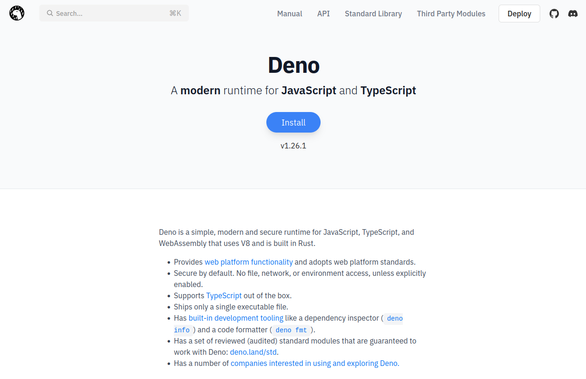

# Automate Boring Tasks with Deno and the Command Line
---

### we have *lots* of repetitive tasks that we do manually

<iframe src="https://giphy.com/embed/lZfU9MnEJ4di0" width="480" height="478" frameBorder="0" class="giphy-embed" allowFullScreen></iframe><p><a href="https://giphy.com/gifs/reactiongif-lZfU9MnEJ4di0">via GIPHY</a></p>

---
### lets help you go from feeling like this

<iframe src="https://giphy.com/embed/wvQIqJyNBOCjK" width="480" height="387" frameBorder="0" class="giphy-embed" allowFullScreen></iframe><p><a href="https://giphy.com/gifs/glee-image-wiki-wvQIqJyNBOCjK">via GIPHY</a></p>

<iframe src="https://giphy.com/embed/5eFp76zhsq3uw" width="480" height="277" frameBorder="0" class="giphy-embed" allowFullScreen></iframe><p><a href="https://giphy.com/gifs/5eFp76zhsq3uw">via GIPHY</a></p>

---

### to this, with the power of the command line

<iframe src="https://giphy.com/embed/YQitE4YNQNahy" width="480" height="270" frameBorder="0" class="giphy-embed" allowFullScreen></iframe><p><a href="https://giphy.com/gifs/YQitE4YNQNahy">via GIPHY</a></p>

---

### What is Deno?



---

### Okay Mr. Deno Shill, but what is Deno *actually*?

- An runtime environment for Javascript/Typescript
- Set of tools to help build Javascript/Typescript projects (bundler, compiler, language server, task runner, test runner, REPL, documentation generator, AND more)
- Designed to be edge-native (Netlify wrote their new "Edge Functions" platform on top of Deno)
- An attempt by the original creator of Node (Ryan Dahl) to correct his biggest mistakes when building Node

---

### Why should I care?

<iframe src="https://giphy.com/embed/tmQrpA8zpG4a16SSxm" width="480" height="480" frameBorder="0" class="giphy-embed" allowFullScreen></iframe><p><a href="https://giphy.com/gifs/pbsnature-tmQrpA8zpG4a16SSxm">via GIPHY</a></p>

---

### Why should I care?
- Playing with new tools in the web ecosystem can be fun!
- While Deno was not designed specifically for scripts, it's *damn* good at handling them

---

### Why should I care?

- Out-of-the-box Typescript support
- Bundler & compiler included (can compile your scripts down to a single binary if you want!)
- You add the specific version of a package to your dependencies list so that it doesn't break down the line
- Deno's permissions system is well thought out (*opt-in* to permissions, unlike Node)
- You have access to *most* of the native Web APIs that you already know and use a lot (Promises, `fetch`, top-level `async/await`, etc)

---

### Adding a package

In Node
- find a package on https://npmjs.com or via your favorite search engine
- Install the package from your favorite package manager (`npm`, `yarn`, `pnpm`)
	- `npm i better-sqlite3`

---

### Adding a package

In Deno
- search for a package on your favorite search engine
- does that package host the version online for you?
	- If yes, grab the URL and add it to your dependencies
	- If no, check one of https://esm.sh or https://skypack.dev to see if the package is supported with ESM and add their link to your dependencies

---

### Adding a package (contd...)

In Deno
- most common Deno packages are available on Deno's Third Party Modules hosting platform (https://deno.land/x)
	
---

### Getting Set Up with Deno (Installing)

- https://deno.land/#installation has a quick-start guide
- https://deno.land/manual/getting_started/installation has a more detailed explanation
- Homebrew (Mac): `brew install deno`

---

### Getting Set Up with Deno (Editor)

[Editor setup documentation](https://deno.land/manual@v1.26.1/getting_started/setup_your_environment)

VSCode
- Search for `Deno` or `vscode_deno` in the Extensions

---

### Basics of Deno: Running a script

- Running: `deno run <path-to-file>`
- Compiling to a binary: `deno compile <path-to-file>`

---

### Basics of Deno: Permissions System

[Permissions system documentation](https://deno.land/manual@v1.26.1/getting_started/permissions)

All of the different permissions flags you can use:
- `--allow-env`, `--allow-hrtime`, `--allow-net`, `--allow-ffi`, `--allow-read`, `--allow-write`, `--allow-run`, `--allow-all/-A`

---

### Basics of Deno: Config file

[Configuration file documentation](https://deno.land/manual@v1.26.1/getting_started/configuration_file)

- `deno.json` or `deno.jsonc` is supported as a JSON configuration file
- `compilerOptions`: provides same options as in a `tsconfig.json` file
- `tasks`: similar to the `scripts` in a `package.json` file, instructs Deno's task runner
- and more! (`import_map`, `lint`, `test`, `fmt`)

---

### Basics of Deno: Import Maps

- Browser standard that Deno has now implemented
- Convention in Deno before was to use a `deps.ts` file where you import all of your dependencies, and export them aliased

```typescript
// deps.ts
export {
  Database,
  Row,
} from 'https://deno.land/x/sqlite3@0.4.3/mod.ts';
```

```typescript
// myProgram.ts
import { Database, Row } from './deps.ts';
```

---

### Basics of Deno: Import Maps

[Import map documentation](https://deno.land/manual@v1.26.1/linking_to_external_code/import_maps#import-maps)

- Define our dependencies in a JSON format, give them aliases that we will use in our project
- Keeps firmly-versioned dependencies from the URL like Deno prefers, gives developers easier way to import dependencies in the project with lower mental overhead

---

### When is the fun gonna start happening?

<iframe src="https://giphy.com/embed/10fxZavhBFXsUE" width="480" height="349" frameBorder="0" class="giphy-embed" allowFullScreen></iframe><p><a href="https://giphy.com/gifs/falling-asleep-leaning-10fxZavhBFXsUE">via GIPHY</a></p>

---

### Adding our first dependency: Cliffy

[Cliffy's documentation](https://cliffy.io/)

- Package that gives us CLI superpowers in Deno
- Common UI components that we would want to use while building command line interfaces

---

### Live coding time!

<iframe src="https://giphy.com/embed/LRVnPYqM8DLag" width="480" height="269" frameBorder="0" class="giphy-embed" allowFullScreen></iframe><p><a href="https://giphy.com/gifs/reactiongifs-LRVnPYqM8DLag">via GIPHY</a></p>

---

### Extra resources

- For those of you who prefer GUIs and are on Macs, checkout ScriptKit or Deno WebView
  - [ScriptKit uses Node, but has some awesome utilities to just get writing scripts and not think
    about it too much](https://www.scriptkit.com/)
  - [Deno WebView is very experimental, but allows you to build your own mini web UI from a Deno
    script](https://github.com/webview/webview_deno)

### Thank you for listening, any questions?

<iframe src="https://giphy.com/embed/W1ecIq4sEofza" width="480" height="270" frameBorder="0" class="giphy-embed" allowFullScreen></iframe><p><a href="https://giphy.com/gifs/kung-fury-W1ecIq4sEofza">via GIPHY</a></p>
